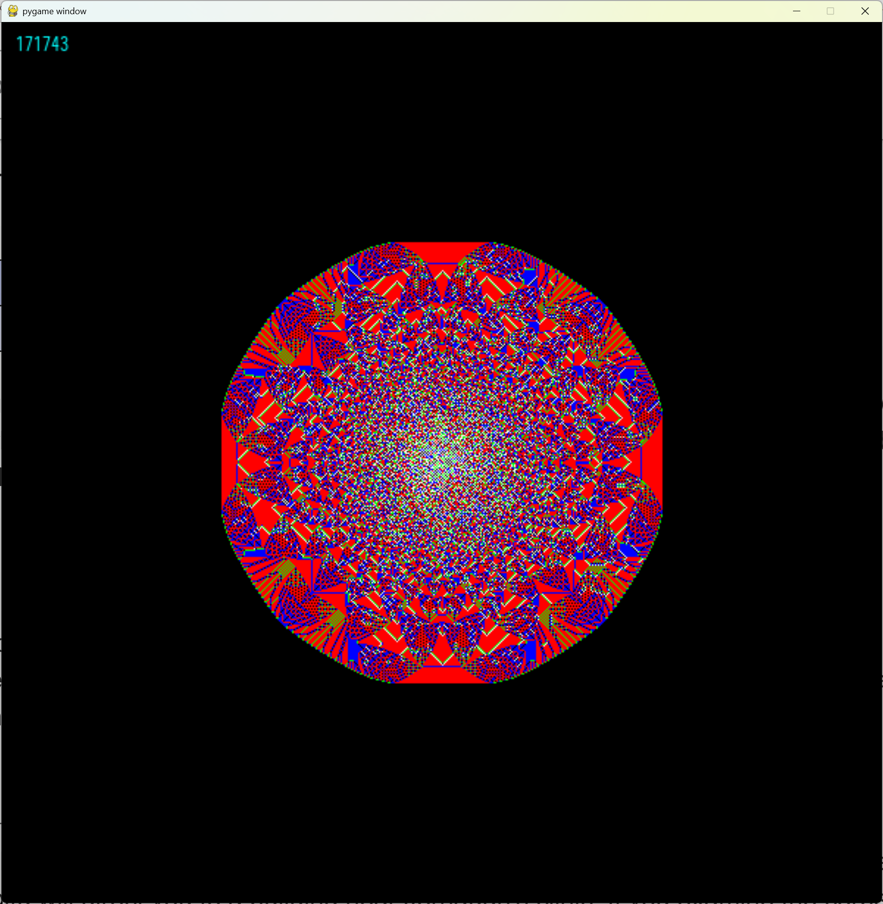

# Sandhill

A visual simulation of the [Abelian sandpile model](https://en.wikipedia.org/wiki/Abelian_sandpile_model) using Python, NumPy, and Pygame.



## Requirements

The project uses `uv` for dependency management. See `pyproject.toml` for dependencies.

- Python 3.13+
- NumPy
- Pygame

## Usage

You can run the simulation using `uv`:

```bash
uv run sandhill.py
```

Alternatively, if you have the dependencies installed in your environment, you can run it directly with Python:

```bash
python sandhill.py
```

## Keyboard Shortcuts

- `Space`: Save the current simulation frame as an image in the `out` directory (e.g., `out/out-000000001.png`).
